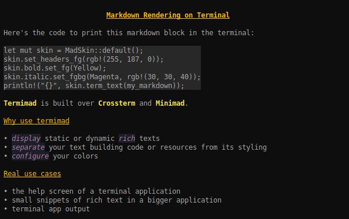
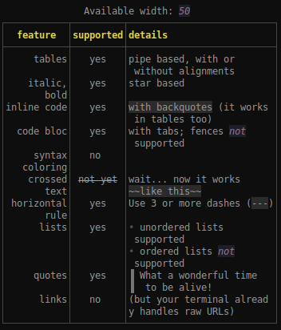

[![MIT][s2]][l2] [![Latest Version][s1]][l1] [![docs][s3]][l3] [![Chat on Miaou][s4]][l4]

[s1]: https://img.shields.io/crates/v/termimad.svg
[l1]: https://crates.io/crates/termimad

[s2]: https://img.shields.io/badge/license-MIT-blue.svg
[l2]: LICENSE

[s3]: https://docs.rs/termimad/badge.svg
[l3]: https://docs.rs/termimad/

[s4]: https://miaou.dystroy.org/static/shields/room.svg
[l4]: https://miaou.dystroy.org/3


A simple tool to display static or dynamic Markdown snippets in the terminal, with skin isolation.

Based on [crossterm](https://github.com/TimonPost/crossterm) so works on most terminals (even on windows).



Note that the goal isn't to display any markdown text with its various extensions (a terminal isn't really fit for that). The goal is rather to improve the display of texts in a terminal application when we want both the text and the skin to be easily configured.

**Wrapping**, table balancing, and **scrolling** are essential features of Termimad.

A text or a table can be displayed in an *a priori* unknown part of the screen, scrollable if desired, with a dynamically discovered width.

For example this markdown:

	|:-:|:-:|-
	|**feature**|**supported**|**details**|
	|-:|:-:|-
	| tables | yes | pipe based, with or without alignments
	| italic, bold | yes | star based |
	| inline code | yes | `with backquotes` (it works in tables too)
	| code bloc | yes |with tabs; fences *not* supported
	| syntax coloring | no |
	| crossed text |  ~~not yet~~ | wait... now it works `~~like this~~`
	| horizontal rule | yes | Use 3 or more dashes (`---`)
	| lists | yes|* unordered lists supported
	|  | |* ordered lists *not* supported
	| quotes |  yes |> What a wonderful time to be alive!
	| links | no | (but your terminal already handles raw URLs)
	|-

will give different results depending on the width:




##  Usage

```toml
[dependencies]
termimad = "0.4"
```

### With the default skin:

```rust
termimad::print_inline("**some** *nested **style*** and `some(code)`");
```
or
```rust
print!("{}", termimad::inline("**some** *nested **style*** and `some(code)`"));
```

Result:


### Inline snippets with a custom skin:

*Inline snippets* are one line or less.

```rust
let mut skin = MadSkin::default();
skin.bold.set_fg(Yellow);
skin.print_inline("*Hey* **World!** Here's `some(code)`");
skin.paragraph.set_fgbg(Magenta, rgb!(30, 30, 40));
skin.italic.add_attr(Underlined);
println!("\nand now {}\n", skin.inline("a little *too much* **style!** (and `some(code)` too)"));
```

Result:


#### Texts

*Texts* can be several lines. Tables and code blocks are automatically aligned, justified and consistently wrapped.

```rust
skin.print_text("# title\n* a list item\n* another item");
```

### Scrollable TextView in a raw terminal:


The code for this example is in examples/scrollable. To read the whole text just do

    cargo run --example scrollable


## Advices to get started

* Start by reading the examples (in `/examples`): they cover the whole API and especially all the skin definition functions. They also show how you can use the alternate screen and scroll a page.
* If you want to see how some file would look with Termimad, you may try the cli [Clima](https://github.com/Canop/clima).
* Be careful that some colors aren't displayable on all terminals. The default color set of your application should not include arbitrary RGB colors.
* If a feature is missing, or you don't know how to use some part, come and ping me on my chat during West European hours.

[broot](https://github.com/Canop/broot) is a real application using Termimad to handle its help screen (if you're the author of another one, please tell me), you might want to see how it does it.
