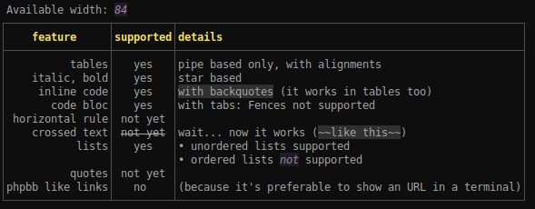
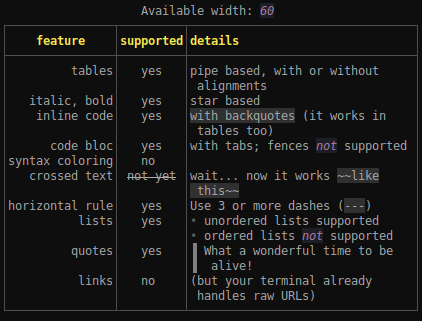

[![MIT][s2]][l2] [![Latest Version][s1]][l1] [![docs][s3]][l3] [![Chat on Miaou][s4]][l4]

[s1]: https://img.shields.io/crates/v/termimad.svg
[l1]: https://crates.io/crates/termimad

[s2]: https://img.shields.io/badge/license-MIT-blue.svg
[l2]: termimad/LICENSE

[s3]: https://docs.rs/termimad/badge.svg
[l3]: https://docs.rs/termimad/

[s4]: https://miaou.dystroy.org/static/shields/room.svg
[l4]: https://miaou.dystroy.org/3


A simple tool to display static or dynamic Markdown snippets in the terminal, with skin isolation.

Based on crossterm so works on most terminals (even on windows).


Note that the goal isn't to display any markdown text with its various extensions (a terminal isn't really fit for that). The goal is rather to improve the display of texts in a terminal application when we want both the text and the skin to be easily configured.

**Wrapping**, table balancing, and **scrolling** are essential features of Termimad.

A text or a table can be displayed in an *a priori* unknown part of the screen, scrollable if desired, with a dynamically discovered width.

For example this markdown:

	|:-:|:-:|-
	|**feature**|**supported**|**details**|
	|-:|:-:|-
	| tables | yes | pipe based only, with alignments
	| italic, bold | yes | star based |
	| inline code | yes | `with backquotes` (it works in tables too)
	| code bloc | yes |with tabs: Fences not supported
	| horizontal rule |  not yet
	| crossed text |  not yet | ---this isn't crossed---
	| lists | yes|* unordered lists supported
	|  | |* ordered lists *not* supported
	| quotes |  not yet
	| phpbb like links | no | (because it's preferable to show an URL in a terminal)
	|-

will give different results depending of the width:





##  Usage

```toml
[dependencies]
termimad = "0.3"
```

### With the default skin:

```rust
termimad::print_inline("**some** *nested **style*** and `some(code)`");
```
or
```rust
print!("{}", termimad.inline("**some** *nested **style*** and `some(code)`"));
```

Result:


### With a custom skin:

```rust
    let mut skin = MadSkin::default();
    skin.bold.set_fg(Yellow);
    skin.print_inline("*Hey* **World!** Here's `some(code)`");
    skin.paragraph.set_fgbg(Magenta, rgb!(30, 30, 40));
    skin.italic.add_attr(Underlined);
    println!("\nand now {}\n", skin.inline("a little *too much* **style!** (and `some(code)` too)"));
```

Result:


### Scrollable TextView in a raw terminal:


The code for this example is in examples/scrollable. To read the whole text just do

    cargo run --example scrollable

